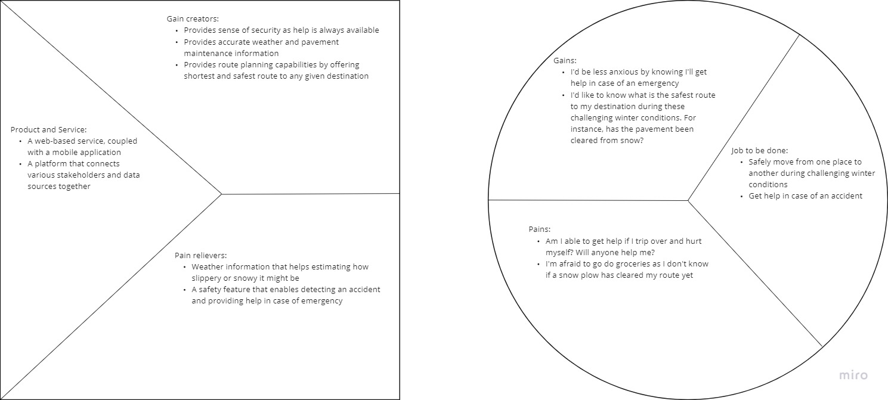
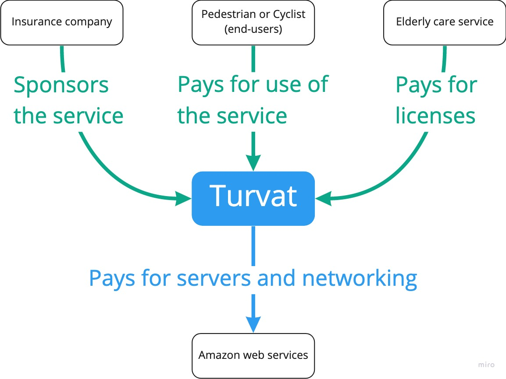

# Turvat

## Idea description
Turvat is a platform service aimed for people who are walking or cycling in winter conditions. The service is especially targeted for elderly people but can be handy for pedestrians and cyclists of all ages as well. The system has two key functions for users: 1) alert on hazardous conditions to prevent accidents, and 2) help getting help in case of an accident. Other users of the system are municipalities, who are responsible for maintaining pavements by plowing snow and adding sand on icy conditions. Third user group is insurance companies as they are typically the ones who are on the payer side in case of sick leaves, insurance compensation, and so forth. Turvat service can be also licensed. A common licensing use case would be nursing homes and caregiver service providers, who would let their customers use the Turvat service. This way they could provide help for their customers in case of an emergency.

The service consists of two parts: 1) the Turvat web platform, and 2) Turvat mobile application. In short, the application works in the following way: user enters his/her destination along with the mode of transport: walk or cycle. When the user is moving, the application is monitoring the phone's gyroscopic sensors. In case the system detects user trips over, the event is recorded and details (time, location, anonymized user data) are sent to the Turvat platform. In addition, the user is being prompted if she/he wants to call predefined emergency contact. In case there is no response, and the user hasn’t moved for some time, i.e., the person is still lying on the ground, the phone will make an automatic emergency call.

## Data spaces
Turvat uses various open data services:
   * Weather data is obtained through Ilmatieteenlaitos web API’s
   * Pavement maintenance and condition data is provided by municipalities, e.g.:
      * https://wp.oulunliikenne.fi/avoin-data/pyorailykavely/graphql-rajapinnat/#kunnossapitotiedot
      * https://data.ouka.fi/data/en_GB/dataset/jalankulkijoiden-liukastumisvaroitukset-oulussa
   * For routing, Turvat uses Google Maps

Turvat also has its own database, containing information of accidents that have happened to its users. This anonymized information is shared with users, for example in case accidents have recently happened on the user's planned route. The collected data also serves other use cases as well, such as providing information for municipalities and insurance companies. Also, the database enables location tracking and monitoring capabilities for caregivers and nursing homes.

## Value proposition
Given pedestrian and cyclist accidental falls is a significant cost to insurance companies, and given it is the responsibility of municipalities to ensure pavements are in safe condition, this kind of solution provides important insight into how walking and cycling in our Nordic winter conditions can be made safer. From the user viewpoint, the system provides important information about weather conditions, helping to plan the fastest and safest route to a destination. And in case of an accident, it will assist getting help, or even automatically make an emergency call on the user's behalf and possibly even save lives. This, in turn, relieves anxiety that is associated with walking or cycling during challenging winter conditions -- for both end users and those who want to ensure their loved ones or customers will get help if needed. For caregiving services or nursery homes, Turvat is also a nice value-add service that helps to differentiate in the market.

## Financials
The money comes from three different sources: 1) end-users, 2) licensing, and 3) insurance companies. End-users pay for the use of the service. The service fee is paid annually and covers the use of the service through web and mobile. There could be multiple plans available as the service grows but, for now, there’s only one product tier. Licensing is another source of income for the service. Caregiving companies, nursing homes, etc. can purchase licenses. A discount, based on the number of licenses and length of contract will be applied. Licensing model is user-based. Third source of income is insurance companies. Since they are benefitting from the service, they are encouraged to financially support the service. Supporting the service will provide them good-will and visibility.

## Ecosystem Map

## Data flow diagram

## Terms and Conditions of used data services

The Turvat platform utilizes data from multiple sources, which have their own terms and conditions for use.

### Finnish meteorological institute
<ul>
 <li>Creative commons Attribution 4.0 license (data source must be credited)</li>
 <li>A maximum of 600 queries can be made within 5 minutes (max 2 queries/minute)</li>
</ul>

### Google Maps
Google has their own [Terms and Conditions](https://developers.google.com/maps/terms-20180207) for the Maps API

### Municipality open data
Each municipality has their own terms and conditions for the usage of open data. These much be considered on a case-by-case basis.
https://wp.oulunliikenne.fi/avoin-data/rajapintojen-kayttooikeusehdot/

## Terms and conditions of Turvat service
* The data that has been generated by using the service is owned by the Turvat service.
* Turvat service follows GDPR, allowing users to request a copy of the data collected of them. Users have also possibility to request their data to be deleted.
* Turvat service provides data about accidents to users and third parties in an anonymized format. Only information about accident, time, location, and weather is provided.
* Consumers of Turvat service data are required to follow licensing terms of data providers Turvat service is using
* Turvat service is operated from within European union
* Turvat service is provided on best-effort basis. Turvat service is not liable for any damage, accidents, nor loss of life.

## Data space design

1) For each of the data sources that are utilised in your platform:

What data is used? Is there a standard data model, format or meta-data for the description of the data?
* Weather data (ilmatieteenlaitos)
* Map data (Google maps)
* Maintenance data (Municipalities e.g. City of Oulu)
* Location and accident data (pedestrian/cyclist)

Who is the owner, creator or provider of the data? 
* External data sources (Ilmatieteenlaitos, Google, municipalities) are owners and creators of data
* Pedestrians/cyclists are also creators of data (but not owners when it comes to accident/location data
* Turvat platform is an owner, creator and provider of data

What kind of permissions and access rights are used? Is there any need for contractual agreements? 
* end-user need to authenticate to have an access to the Turvat platform
* Licensing agreement with the end-user

What are the conditions or terms of use for using the data?
* See “terms and condition of used data services”

Is the long-term availability and use of the data guaranteed?
* Data is not needed for a long term, however data is stored on Turvat database as long as needed
* Ilmatieteenlaitos stores weather data for decades

What interfaces are needed for data retrieval? Are there standard data exchange formats or protocols for the data?
* APIs for all data sources

Are there missing data? What could be done with missing data?
* We have not identified any data missing

Any other issue you have encountered 
* No other issues identified

2) For the data the platform will create for others:

Description of the data. Is there a standard data model, format or meta-data for the description of the data?
* RESTFUL API providing data in json format
* data provided: location, time, weather condition, cyclist or pedestrian, was emergency call made and to whom?

What benefits will the data provide to the stakeholders of the ecosystem?
* see idea description and value proposition

How will the data made available to other stakeholders?
* Via RESTFUL API described above

How are FAIR data principles or the other regulations for data sharing, e.g. GDPR, are taken into account? What interfaces are provided for data exchange? Are there standard data exchange formats or protocols that can be used?
* Services are made public in data space collective and APIs are documented
* GDPR is applicable and Turvat is compliant with GDPR policies
* eIDAS etc. are not applicable to Turvat
* APIs are used for data exchange

What are the conditions or terms of use for using the data?
* See T&C section (Terns & Conditions of Turvat service)

What kind of permissions and access rights will be needed are to you the data? 
* End-users need to authenticate to access the platform 
* All data except accident severity is available for all
* Accident severity is available for commercial accounts/license
* Accident severity is not available for individuals

How will you guarantee quality and reliability of the data is reliable?
* data is validated during ETL process
* records are stored only when complete (incomplete data is not stored)

3) How are the design principles for the data spaces, i.e. data sovereignty, level playing field, decentralised soft infrastructure, public private governance taken into account, if they are relevant for your platform? 
* data sovereignty: personnel data is stored according to GDPR and individuals are entitled to know how data is used and request deletion of their data
* level playing field: we use only data that is available for anyone (municipalities, google maps, ilmatieteenlaitos)
* Decentralized soft infrastructure: not relevant for Turvat, Turvat adapts to any changes e.g. in APIs provided by others in the data space
* Public private governance: Not applicable

4) How will the platform expand and evolve?

Does the platform provide mechanisms for new participants to participate?
* Yes, new municipalities, new customers and new data providers are welcome to join Turvat platform
Is the platform capable of creating new data value chains based on data provided by existing participants or extending the existing data value chains?
* Yes, assuming that this kind of accident data is not currently available. Turvat combines data from different sources and provides useful information for stakeholder groups.
Can the existing participants be replaced without affecting the data value chains they were involved in?
* Weather data provided can be changed, same goes for map. Data coming from municipality is not available elsewhere
Can each participant evolve independently of other participants, as long as the interfaces for interaction with these other participants are respected.
* Yes, absolutely  - no interdependencies that prevents this from happening.

## Service diagrams
### Component and deployment diagram

### Activity diagram: setting navigation

### Activity diagram: detecting accident

