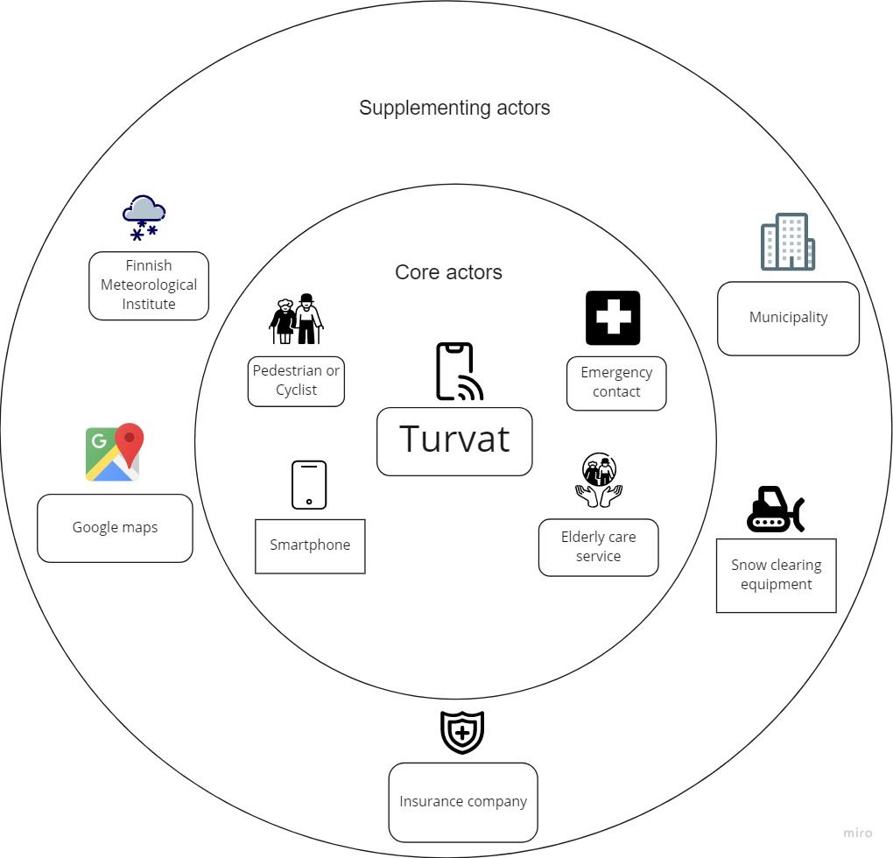

# Turvat

## Idea description
Turvat is a platform service aimed for people who are walking or cycling in winter conditions. The service is especially targeted for elderly people but can be handy for pedestrians and cyclists of all ages. The system has two key functions for users: 1) alert on hazardous conditions to prevent accidents, and 2) help getting help in case of an accident. Other users of the system are municipalities, who are responsible for maintaining pavements by plowing snow and adding sand on icy conditions. Third user group is insurance companies as they are typically the ones who are on the payer side in case of sick leaves, insurance compensation, and so forth. Turvat service can be also licensed. A common licensing use case would be nursing homes and caregiver service providers, who would let their customers use the Turvat service. This way they could provide help for their customers in case of an emergency.

The service consists of two parts: 1) the Turvat web platform, and 2) Turvat mobile application. In short, the application works in the following way: user enters his/her destination along with the mode of transport: walk or cycle. When the user is moving, the application is monitoring the phone's gyroscopic sensors. In case the system detects user trips over, the event is recorded and details (time, location, anonymized user data) are sent to the Turvat platform. In addition, the user is being prompted if she/he wants to call predefined emergency contact. In case there is no response, and the user hasn’t moved for some time, i.e., the person is still lying on the ground, the phone will make an automatic emergency call.

## Data spaces
Turvat uses various open data services:
   * Weather data is obtained through Ilmatieteenlaitos web API’s
   * Pavement maintenance and condition data is provided by municipalities, e.g.:
      * https://wp.oulunliikenne.fi/avoin-data/pyorailykavely/graphql-rajapinnat/#kunnossapitotiedot
      * https://data.ouka.fi/data/en_GB/dataset/jalankulkijoiden-liukastumisvaroitukset-oulussa
   * For routing, Turvat uses Google Maps

Turvat also has its own database, containing information of accidents that have happened to its users. This anonymized information is shared with users, for example in case accidents have recently happened on the user's planned route. The collected data also serves other use cases as well, such as providing information for municipalities and insurance companies. Also, the database enables location tracking and monitoring capabilities for caregivers and nursing homes.

## Value proposition
Given pedestrian and cyclist accidental falls is a significant cost to insurance companies, and given it is the responsibility of municipalities to ensure pavements are in safe condition, this kind of solution provides important insight into how walking and cycling in our Nordic winter conditions can be made safer. From the user viewpoint, the system provides important information about weather conditions, helping to plan the fastest and safest route to a destination. And in case of an accident, it will assist getting help, or even automatically make an emergency call on the user's behalf and possibly even save lives. This, in turn, relieves anxiety that is associated with walking or cycling during challenging winter conditions -- for both end users and those who want to ensure their loved ones or customers will get help if needed. For caregiving services or nursery homes, Turvat is also a nice value-add service that helps to differentiate in the market.

## Financials
The money comes from three different sources: 1) end-users, 2) licensing, and 3) insurance companies. End-users pay for the use of the service. The service fee is paid annually and covers the use of the service through web and mobile. There could be multiple plans available as the service grows but, for now, there’s only one product tier. Licensing is another source of income for the service. Caregiving companies, nursing homes, etc. can purchase licenses. A discount, based on the number of licenses and length of contract will be applied. Licensing model is user-based. Third source of income is insurance companies. Since they are benefitting from the service, they are encouraged to financially support the service. Supporting the service will provide them good-will and visibility.

## Ecosystem Map

